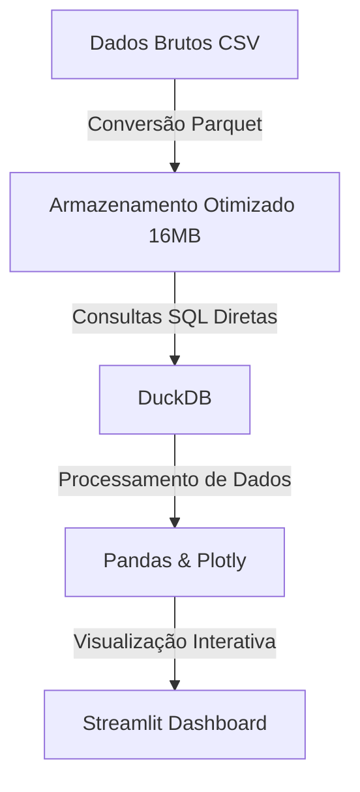

# NYC Taxi Analytics (2015 - 2016) 🚕


## 🧠 Abstract

**NYC Taxi Analytics** é o resultado prático de um desafio proposto pela comunidade **Dados Por Todos**. O objetivo? Mergulhar em dados reais das corridas de táxi de Nova York (com foco no biênio 2015-2016) e construir um dashboard interativo capaz de traduzir números brutos em visões de negócio claras.
Os dados brutos utilizados nesta análise foram extraídos do dataset público [NYC Yellow Taxi Trip Data no Kaggle](https://www.kaggle.com/datasets/elemento/nyc-yellow-taxi-trip-data).

## ⚙️ Core Architecture (Gigabytes vs. RAM)

Para contornar o gargalo de memória ao processar milhões de registros, a arquitetura foi otimizada trocando o processamento em memória por consultas eficientes em disco.



* **Parquet sobre CSV:** A substituição do formato reduziu drasticamente o peso dos dados.
* **O poder do DuckDB:** Consultas diretas nos arquivos otimizados, analisando mais de 500 mil registros de forma rápida sem esgotar a RAM da máquina.

## 🚀 Key Features & Insights

Com o pipeline de dados otimizado, o dashboard revela os padrões ocultos da operação:

* **Corridas de "Tiro Curto":** A grande maioria das viagens dura menos de 20 minutos, com distância média de 4,8 km e tarifa média de $11.84.
  <details>
  <summary>Visualizar Gráfico</summary>
  
  </details>

* **A Cidade Que Não Dorme:** O pico da demanda ocorre no início da noite (18h-20h), com aumento expressivo no volume nas sextas e sábados devido ao fluxo de lazer noturno.
  <details>
  <summary>Visualizar Gráfico</summary>
  
  </details>

* **Concorrência e Pagamentos:** Mercado equilibrado (47.5% vs 52.5% entre os dois principais fornecedores da cidade). Além disso, a era do cartão de crédito domina quase que totalmente a preferência em relação ao dinheiro físico.
  <details>
  <summary>Visualizar Gráfico</summary>
  
  </details>

## 🛠️ Repository Structure

```bash
TAXI NY/
├── dados/                       # Diretório de dados
│   ├── dados_amostra.parquet    # Amostra de dados reduzida
│   └── dados_taxi_processados.parquet # Base consolidada
├── dashboard.py                 # Interface principal do Streamlit
├── main.py                      # Pipeline de processamento de dados
└── requirements.txt             # Dependências (DuckDB, Streamlit, etc)
```

## 💻 Quick Start (Local & Cloud)

**Acesso Rápido na Nuvem:**
👉 **[Acessar o NYC Taxi Dashboard](https://nyc-taxi-dashboard-0.streamlit.app/)**

**Rodando Localmente:**
1. Faça o Clone deste repositório em sua máquina.
2. Crie e ative um ambiente virtual:
   ```bash
   python -m venv .venv
   # Windows: .venv\Scripts\activate
   # Linux/Mac: source .venv/bin/activate
   ```
3. Instale as dependências:
   ```bash
   pip install -r requirements.txt
   ```
4. Execute o dashboard via Streamlit:
   ```bash
   streamlit run dashboard.py
   ```

## 📄 License

Distribuído sob a Licença MIT.
